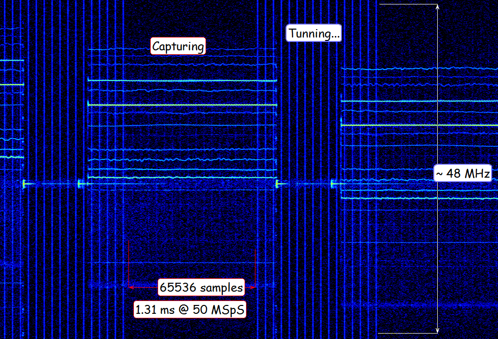

# libfobos_sdr RigExpert Fobos SDR (agile) API

Special version of the Fobos SDR receiver host software API shared library. Lightweight and easy to start. Full source code. Allpication examples.

## Features

- slightly different enumeration, control and streaming concept
- agile controls
- fast frequency scan mode
- this library could be used alongside with original [**libfobos**](https://github.com/rigexpert/libfobos)

## Limitations

- special firmware required

## Versions

See [versions.txt](versions.txt)

## Platforms tested on

- Linux (Ubuntu 18.04 LTS, Ubuntu 22.04 LTS, Raspbian ...)
- Windows (7, 8.1, 10, 11) x86, x64

## Requirements

- git v.2.31 or later (otherwise download the repository manualy: Code->Download ZIP)
- any **c** compiler (tested on gcc, g++, mingw, msvc) 

## Dependencies

- libusb-1.0-0 v.1.0.21 or higher

## How to upload a firmware (OS Windows only)

- download a special firmware pack (see [**Releases**](releases) section)
- unpack anywhere
- follow the instructions in Readme.txt

## How to build and evaluate

### Linux
```
git clone [this repo]
cd libfobos_sdr
mkdir build
cd build
cmake ..
make
subo make install
sudo udevadm control --reload-rules
sudo udevadm trigger
```
### Windows
```
git clone [this repo]
cd libfobos_sdr
mkdir build
cd build
cmake ..
```
to build Win32 binaries (legacy software) use

```
cmake .. -A Win32
```

Visit https://github.com/libusb/libusb/releases<br />
Download any libusb release 7z pack, for example  libusb-1.0.27.7z<br />
Unpack content of **libusb-1.0.27.7z** to **libusb** directory<br />
```
cmake --build . --config Release
```
or<br />
open **fobos.sln** in your favorite **MS VisualStudio IDE**, build, debug, trace, evaluate.<br />

## How to use Fobos SDR (agile) API elsewhere

- build, install, include header **fobos_sdr.h**, link library **libfobos_sdr.so**, **fobos_sdr.dll**  
- see **eval/fobos_sdr_devinfo_main.c**  for simple device enumeration example
- see **eval/fobos_sdr_recorder_main.c** for basic application example 
- see **eval/fobos_sdr_scanner_main.c** for frequency scanner application example
- feel free to evaluate

## How it looks like

<br />

## What is actually Fobos SDR

For more info visit the main product page

https://rigexpert.com/en/products/kits-en/fobos-sdr/
